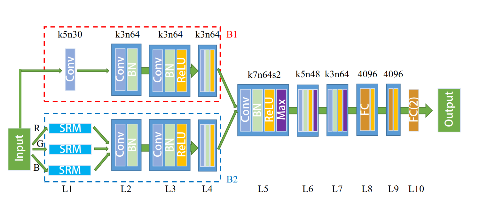

# Outlier_cgvsni

Computer generation of photo-realistic images has become potent enough that some images can now pass as natural images to the human eye. In order to avoid potential abuses in the future, it has become necessary to come up with tools to realize that for us. CNN-based deep neural networks have shown good promises in achieving good classification accuracy. However, standard supervised training has proven to be very sensitive to domain shift. Through the use of semi-supervised learning, this article aims to study a potential solution to this issue, comparing the results on four different datasets of high quality CG images.

This project is the continuation of a work that was started throughout a 6 months internship. The base idea (flow models and outlier detection applied to image classification) started as an offshoot of a project realized at the start of the year (fillière recherche) which utilized these models to do outlier detection of fraudulent banking data.

## Context and objectives

State-ot-the-art for this problem is the following article : https://hal.archives-ouvertes.fr/hal-02929038/file/manuscript_di.pdf

As shown by the results of the experimentation in the above work, CG image detection is a task that is very sensible to domain shift (here, changing the algorithm that renders the CG images). To address this issue, a semi-supervised approach (only labeling part of the dataset, and leaving the rest unlabeled) is used.

The goal here is to use the supervised part of the dataset (containing natural and CG images) to train a "mapping" of images into a set number of features. This model will then be applied to all of the remaining unlabeled images, to turn them into their latent features ; and this mapping will then be used to train a flow model using Deep SVDD, in order to allow for outlier detection.

## Image map

To provide us with our mapping, we use the model studied in our reference article. This model, ENet (fig 1), is designed with and output layer to be used with a standard supervised learning scheme (use crossentropy loss). But we can see that the layers L8 and L9 are fully connected layers, at the end of the processing chain. Hence their outputs should be good mappings of the relevant features of each image. This is why the image map model is going to be a ENet mode, but where the actual mapping is taken from the second-to-last last layer (which is here L9).

<b>Fig.1 - ENet base model used for direct supervised classification</b>

In order to train the mapping, we use the same training method as stated in the reference article :
- Each image is center cropped (to allow the use of any image of sufficient size, regardless of dimensions) and normalized
- Training is done over 60 epochs
- Loss is calculated using torch.nn.CrossEntropyLoss

We can do this supervised training step only with the labeled part of our dataset.

## Flow model and outlier detection

Now that we have access to a mapping of any image, we can train our outlier detection stage. Note that this stage has to be done independently from the previous stage, as one of the main requirements of FlowSVDD training is a model with constant jacobian for every entry possible, which would not be the case if we just trained a singular model combining our ENet stage with our flow model stage. The main ressource for flow SVDD is the following article : https://arxiv.org/pdf/2108.04907.pdf

The main idea in flow SVDD is to train a model to map our feature space to another, same dimensional space of latent features, such as out data is a tightly packed as possible. Jacobian being constant, the mapping keeps volumes unchanged, with a multiplicative constant. This forces the algorithm to actually learn something instead of producing trivial solutions (like mapping everything to the same point, which would indeed minimize the area of the sphere enclosing the data in our latent space). The following loss is used :

